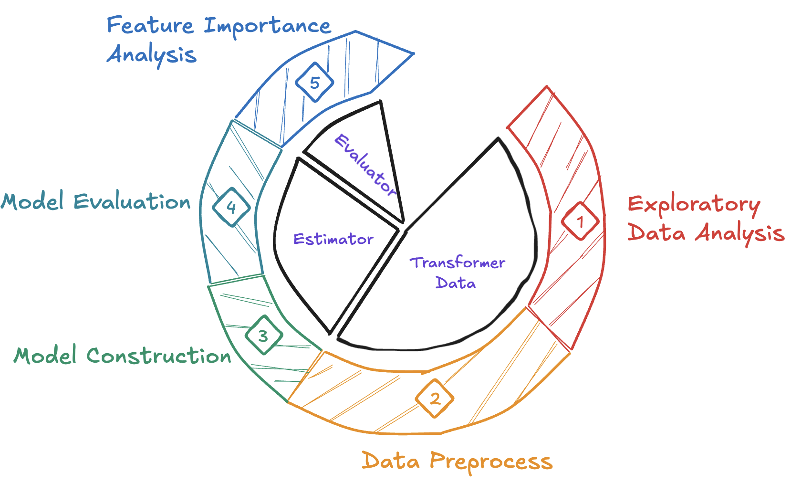

# Classification of Hotel Booking Cancellations.

In the hotel business, booking cancellations by customers are a common and serious issue. They not only lead to a direct loss in revenue but also affect operational planning, resource allocation, and vacancy management. A sudden cancellation can result in rooms not being reassigned in time, causing resource waste. Therefore, early prediction of whether a booking will be canceled is extremely important, enabling hotels to take timely intervention measures.

The main objective of this study is to develop machine learning models capable of classifying and predicting whether a specific hotel booking will be canceled or not based on relevant booking information. Additionally, the goal is to apply these models to real-world scenarios to support practical prediction and decision-making in hotel operations.

## 🔄 Project Workflow

The overall workflow of this project follows a 5-step machine learning lifecycle, as illustrated below:

## 📊 Problem Overview & Evaluation Metric

In this hotel booking classification task, the **target variable** indicates whether a reservation will be **canceled** or **not**.

Both types of prediction errors — **False Positives** and **False Negatives** — can cause losses for the hotel:

- ❗ **False Negatives:** These are especially costly, as the hotel may **overbook** based on the incorrect assumption that some guests will cancel. If they don’t, the hotel may run out of rooms and lose potential customers.  
  → Therefore, **minimizing FN** (i.e., **maximizing Recall**) for the *cancellation* class is **critical**.

- ⚠️ **False Positives:** These occur when the model predicts a cancellation, but the guest actually shows up. This could lead to **unnecessary overbooking** and **customer dissatisfaction**.

To balance both Precision and Recall, I use the **F1-score** as the primary evaluation metric.

> 🎯 **Key metric**:  
> The **F1-score of the *canceled* class** is the most important metric for evaluating model performance in this project.

## 🧪 Model Development & Evaluation

During the model development process, I referred to the approach of Farzad Nekouei, particularly for feature engineering and model evaluation. In addition to XGBoost, I also implemented several other models such as **Logistic Regression, LightGBM, and CatBoost**, as well as more modern deep learning models like **TabNet and FT-Transformer**.

Despite these efforts, the **XGBoost model still delivered the best performance**, likely due to better suitability or lack of tuning in other models. Below is the comparison of model performance on the test set:

| Model Name           | Accuracy | Precision | Recall | F1-score | AUC   |
|----------------------|----------|-----------|--------|----------|--------|
| Decision Tree        | 80.30    | 70.50     | 80.61  | 75.22    | 88.63  |
| Random Forest        | 83.78    | 77.41     | 79.43  | 78.41    | 91.38  |
| **XGBoost**          | **84.70**| **79.18** | **79.67** | **79.42** | **92.06** |
| LightGBM             | 83.76    | 78.40     | 77.57  | 77.98    | 90.92  |
| CatBoost             | 80.09    | 67.89     | 87.87  | 76.60    | 91.49  |
| Logistic Regression  | 78.42    | 70.62     | 71.56  | 71.09    | 85.14  |
| TabNet               | 82.16    | 85.12     | 62.87  | 72.32    | 88.48  |
| FT-Transformer       | 81.27    | 87.10     | 58.10  | 69.70    | 86.66  |

Given these results, I have chosen to **deploy the XGBoost model** in a basic web application that allows **hotel staff or managers** to predict whether a booking is likely to be canceled based on its details.
